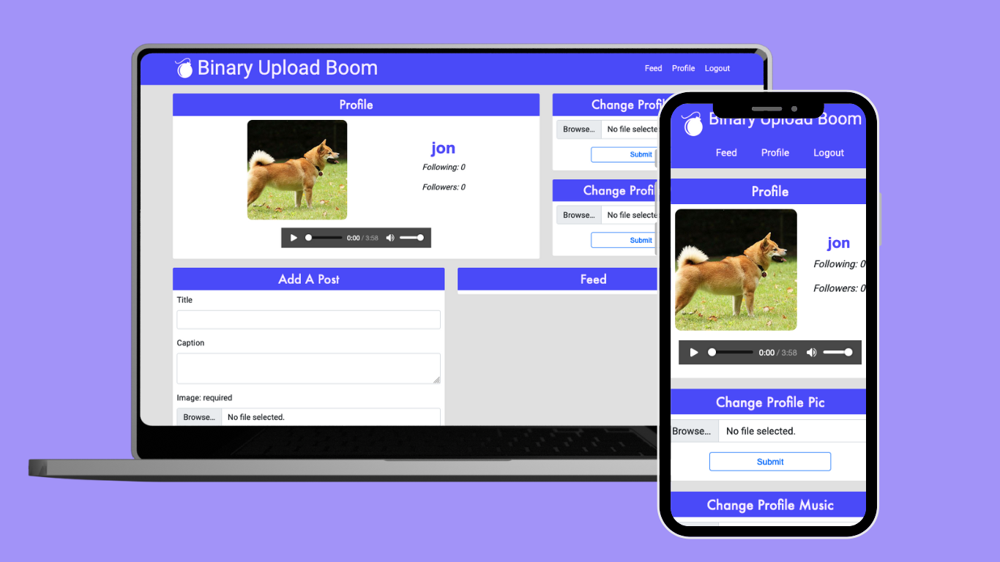

# Binary Upload Booms

A Social Media App that handles all the functionality of a modern day social media app. User can like each other's posts, upload images, write comments, change their profiles and view their feed

## How It's Made

Tech: MongoDB, Express, Node, Cloudinary, Multer, PassportJS, bcrypt, Mongoose, EJS

This app was built using MongoDB as a database, Express and Node to handle server requests, Cloudinary to handle image and music upload and PassportJS to handle user authentication. Bcrypt was used to hash passwords

## Optimizations

For future implementations, I would like to add functionality for users to make their photos public or private.

For UI, I'd also add dark mode, probably by implementing some TailwindCSS

## Lessons Learned

In this project, I learned how to set functionality based on if the user owns that data. For example, only a user can delete their own comment, while other users can only view it.

I also learned how to use Cloudinary as a repository to host all multimedia content and use multer to recognize audio file types

It's also important to map out how data is connected to eachother. For this app, it was important to understand the relationships between posts, users and comments as all of these could belong to different entities.

## Check Out My Other Work

[Pomodoro Task Tracker](https://github.com/jonathanmani/Pomodoro-Task-Tracker) - Create tasks, set your priority and record pomodoro sessions with this all-in-one task tracker

[InstaPrep](https://github.com/jonathanmani/InstaPrep) - Your meals should be an accident. Plan them in minutes with InstaPrep

[My Pocket Dictionary](https://github.com/jonathanmani/Dictionary) - A minimalist dictionary app that uses the Merriam-Webster API

### Contributors

**:point_right: John Malapit**
:e-mail: [contact@johnmal.dev](mailto:contact@johnmal.dev)
:computer: [Github](https://github.com/johnmal-dev/)

**:point_right: Jonathan Mani**
:e-mail: [email@email.com](mailto:social.chapters@simplelogin.com)
:computer: [Github](https://github.com/jonathanmani/)

**:point_right: Sabrina Pyles**

**:point_right: Nic Resch**

**:point_right: Chavis Gill**

**:point_right: Ryan Oh**

**:point_right: Chris Miller**
